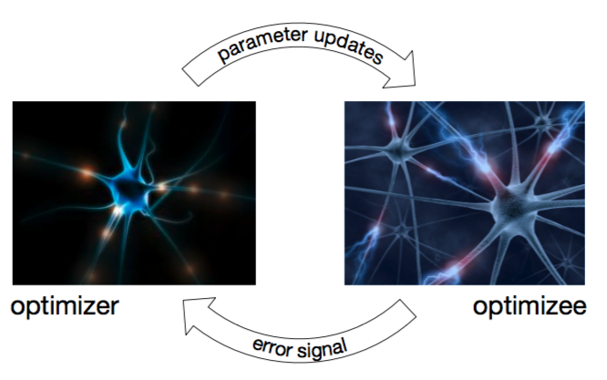

# [Learning to learn by gradient descent by gradient descent](https://arxiv.org/abs/1606.04474)

*by deepmind on NIPS 2016*
- SEOHASONG - Korea Univ.
- 2018.03.25
- Deep Paper Study 신촌

## Abstract

사람들은 목적달성을 위해 경영, 공학, 정치 등 다양한 분야에서 결과에 영향을 주는 변수를 찾고자 노력합니다.

사람이 직접 변수를 찾아낼 수도 있지만, 기계학습이 발전하면서
컴퓨터가 자동으로 변수를 찾는 방식도 주목받고 있습니다.

기계학습에서 알고리즘은 최적화 알고리즘입니다.
최적화알고리즘은 예측이 틀린 정도가 최소가 되도록 설계됩니다.

컴퓨터는 데이터에 알고리즘을 적용해 자동으로 적절한 변수를 찾는 역할을 하며,
여기 사용되는 알고리즘은 사람이 직접 만들어 줘야 합니다.

이 논문에서는 사람이 직접 만들던 최적화 알고리즘을 학습하는 문제를 논의합니다.

- 기존에는 사람이 만든 최적화 알고리즘을 통해 변수를 학습했습니다.
- 앞으로는 최적화 알고리즘을 변수로 두고 그것이 무엇일지 자동으로 학습하고자 합니다.

이 논문의 목적은 *특정 분류의 문제에 대해 잘 동작하는 알고리즘*을 만드는 일련의 과정을 개발하는 것입니다.

*알고리즘 만들기*를 우리가 풀어야 하는 문제로 생각하는 것을 **Meta learning**이라고 부릅니다.

Meta learning 관련 논문으로는 AutoML등이 있으며,

Meta learning은 Few-shot learning(One-shot, Zero-shot 등등)과도 관련이 있습니다.

## Introduction

일반적으로 기계학습 문제는 목적함수라고 불리는

### $f(\theta),\quad\theta\in\Theta$

를 최적화 하는 문제입니다.

식 $f(\theta)$을 최소화(최대화) 하는 파라미터 $\theta \in \Theta$를 찾는 것이 목표입니다.

### $\theta^* = arg\ min_{\theta\in\Theta}\ f(\theta)$

식 $f$는 보통 파라미터 $\theta$에 대해 미분 가능한 함수이며,

이경우 일반적으로 단계적으로 업데이트가 이루어지는 Gradient descent 방식을 이용합니다.

### $\theta_{t+1} = \theta_t\ -\ \alpha_t\nabla f(\theta_t)$

Gradient descent방식은 치명적인 약점이 있습니다.

***단계적으로 한번 미분한 값만 고려하고 두번 미분한 값은 고려하지 못합니다.***

Gradient descent가 아닌 전통적인 최적화 기법에서는 이런 문제를 피할 방법이 있습니다.

함수의 두번 미분한 정도(곡률)의 정보를 이용하는 것입니다.

> 참조
> - Hessian matrix of second-order partial derivatives
> - Generalized Gauss-Newton matrix
> - Fisher information matrix
> - ...

현대의 많은 최적화 기법은 업데이트 규칙을 특정 문제에 깔맞춤하는 방식으로 이루어 졌습니다.

예를들어, 요즘 유행하고 있는 딥러닝 분야에서는

- 고차원 백터공간에서
- Convex가 아닌 형태에서

효과적인 업데이트 규칙을 이용합니다.

> 참조
> - momentum
> - Rprop
> - Adagrad
> - RMSprop
> - ADAM
> - ...

```
More focused methods can also be applied when more structure of the optimization problem is known [Martens and Grosse, 2015]. In contrast, communities who focus on sparsity tend to favor very different approaches [Donoho, 2006, Bach et al., 2012]. This is even more the case for combinatorial optimization for which relaxations are often the norm [Nemhauser and Wolsey, 1988].
```

현실의 각 산업군에서는 해당 분야에서 잘 동작하는 최적화 방식을 연구하지만,

각 방식들은 다른 분야에서는 제대로 동작하지 않을 수도 있습니다.

```
Moreover the No Free Lunch Theorems for Op- timization [Wolpert and Macready, 1997] show that in the setting of combinatorial optimization, no algorithm is able to do better than a random strategy in expectation.
```

이러한 연구들이 시사하는 바는, 일반적으로

1. 분야를 세분화 하고
2. 세분화된 분야에 특화된 방식을 찾는 것

이 유일한 성능 향상의 접근법일수도 있다는 것입니다.

이 논문은 업데이트 규칙을 사람이 직접 만드는 방식에서 학습되는 방식으로 다르게 구하고자 합니다.

학습되는 optimizer(최적화 방식)를 여기서는 $g$라고 명명하겠습니다.

우리는 $g$를 파라미터의 집합 $\phi$에 깔맞춤 되도록 할 것입니다.

기존의 gradient방식은

### $\theta_{t+1} = \theta_t\ -\ \alpha_t\nabla f(\theta_t)$

다음과 같이 수정됩니다.

### $\theta_{t+1} = \theta_t\ -\ g_t(\nabla f(\theta_t), \phi)$

- 여기서 $g$는 meta-learner라고 부르기도 합니다.
- 여기서 $f$는 learner라고 부르기도 합니다.



> 왼쪽의 optimizer가 오른쪽의 optimizee 성능에 대한 정보를 받고 optimizee를 수정합니다.